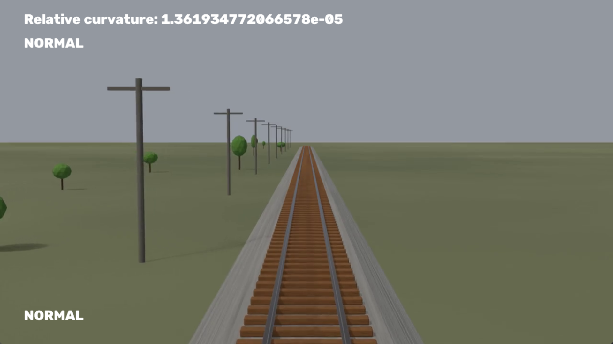
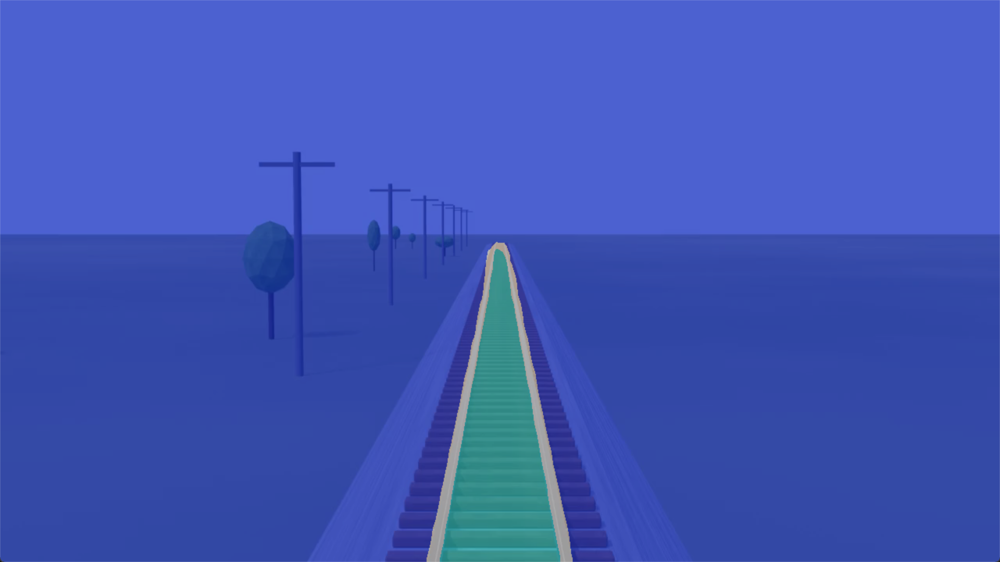
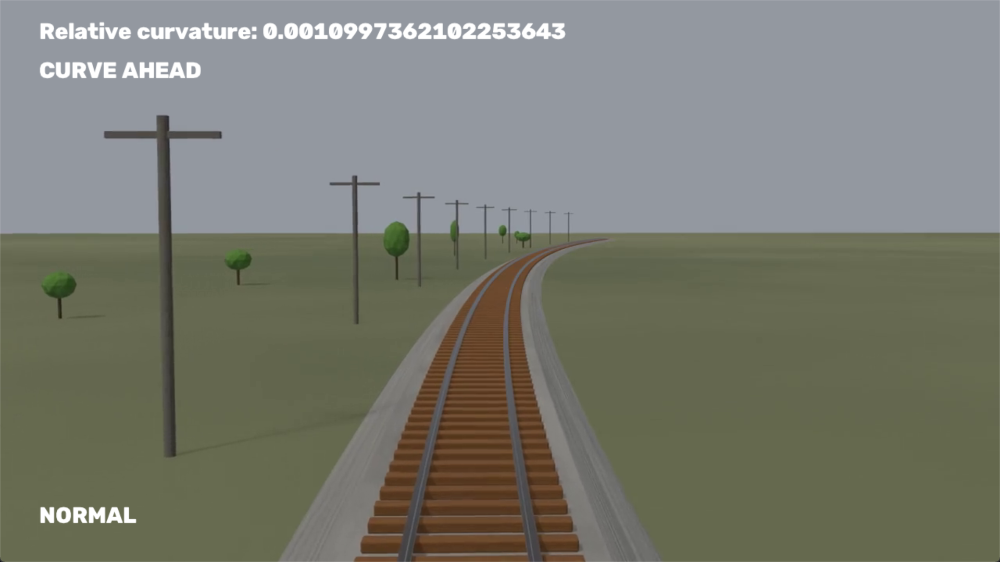
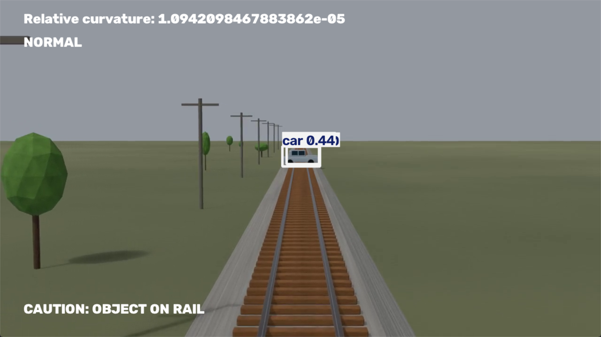

# cv-railway-danger-assessment
Computer vision research project using OpenCV and Ultralytics YOLO. Analyzes railway tracks and returns appropriate responses based on different situations.
## Methods
- ### YOLO object detection
  - Use the default YOLO26 nano model
  - Draw bounding boxes. If a bounding box overlaps with a `rail-track`, `rail-raised`, or `rail-embedded` mask, a warning is displayed on screen
- ### YOLO semantic segmentation for rail curvature calculation
  - Use the YOLO26 nano semantic model
  - Train the model using `python train.py`; to replicate the results, set the argument `epochs=50`
  - After the model yields sufficient results, isolate the `rail-track` mask
  - Scan the `rail-track` mask along the $y\text{-axis}$ from bottom to top to see if the mask exists at each $y$. If so, calculate the midpoint $\frac{x_\text{leftmost}+x_\text{rightmost}}{2}$ and store it in `coords`
  - Plot a second-degree polynomial using the `coords` derived from above, and calculate the curvature using the formula $κ(y)=\frac{|f''(y)|}{(1+[f'(y)]^2)^\frac{3}{2}}$
  - The median curvature, $`κ(y)_{\text{median}}`$, is used to determine the message on screen. If $`κ(y)_{\text{median}}>\text{curvature\_threshold}`$, the railway is curved and a warning message is displayed. This curvature and threshold are relative and not absolute.

  **IMPORTANT: This should not be used to determine railway curvature! For demonstration purposes, the formula is simplified. To obtain an industry-accepted measurement, more data about the vehicle is required.**
## Results
- The trained model achieved the following mIoU results:

  | Overall | rail-track | rail-raised | rail-embedded |
  |---------|------------|-------------|---------------|
  | 0.74075 | 0.867      | 0.597       | 0.514         |
- Demonstration:

  
  - Straight track and properties
  
  
  - Underlying semantic segmentation mask
  
  
  - Curved track and properties
  
  
  - Obstacle detection

## Known issues
- The model cannot identify which railway the vehicle is running on; this feature will be added in the future
## Acknowledgement
This project utilizes code from [Ultralytics YOLO](https://github.com/ultralytics/ultralytics), licensed under AGPL-3.0. 
This project utilizes the RailSem19 dataset provided by the AIT Austrian Institute of Technology GmbH for training.

[Zendel et al., "RailSem19: A Dataset for Semantic Rail Scene Understanding." IEEE/CVF Conference on Computer Vision and Pattern Recognition Workshops, 2019.](https://mlanthology.org/cvprw/2019/zendel2019cvprw-railsem19/) doi:10.1109/CVPRW.2019.00161